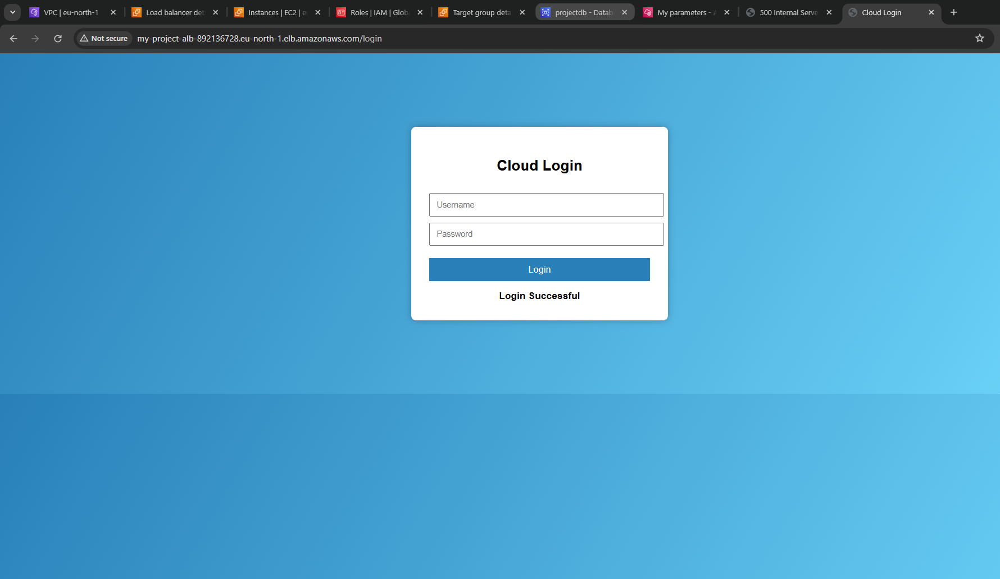

## Description
This is a web application built with Flask and deployed on AWS using a 3-tier architecture:
- **Frontend:** HTML/CSS served by Flask
- **Backend:** Flask application running on EC2
- **Database:** MySQL on AWS RDS
- **Load Balancer:** Application Load Balancer (ALB)

The app allows users to **login with credentials**:
- If the entered username and password are correct, the app returns **"Valid"**.
- If the credentials are incorrect, the app returns **"Invalid"**.

The app demonstrates secure communication between layers and basic credential validation functionality.

---

## Features
- User login authentication (valid/invalid credential validation)
- Database CRUD operations
- Hosted on AWS EC2 with MySQL RDS
- Secure 3-tier architecture


 ---

## Architecture Diagram


---

## How to Run Locally
1. Clone the repository:

```bash
git clone git@github.com:samidha1-1/Secure-3-Tier-Web-Application-Architecture-on-AWS.git
cd cloud-login-app
````
2. Create a Virtual environment

```bash
python3 -m venv venv
source venv/bin/activate
```
3. Install dependencies
```bash
   pip install -r requirements.txt
````
4. Run the flask app
```bash
python app.py
```

## Deployment 
- Deploy on AWS EC2 instance 
- MySQL database hosted on AWS RDS
- Application load balanacer (ALB) routes traffic to the ec2 instance securely

---

## Login valid png 


  
